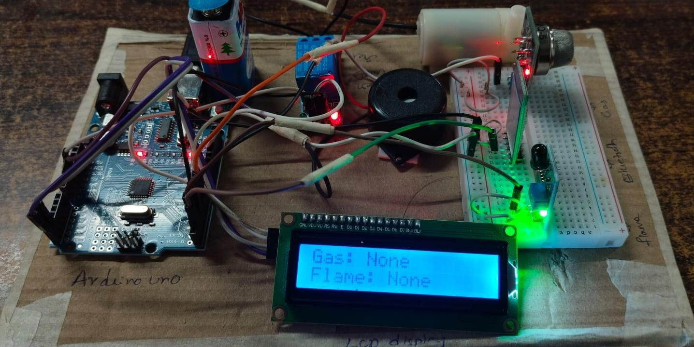

# 🔥 Fire Detection and Automatic Suppression System using Arduino

This project is a smart fire detection and suppression system designed using Arduino Uno. It automatically detects the presence of flames or gas leaks and activates a suppression mechanism (such as a water pump) to mitigate fire hazards. The system also sends real-time alerts to nearby users via Bluetooth through a custom Android application built using MIT App Inventor.

---

## 📝 Project Description

Fire poses a significant threat to life and property, especially in homes, industrial zones, and data centers. This project provides a **cost-effective and automatic** solution to detect flames or gas leakage and **suppress them with a water pump system**. A buzzer and LCD are used for local alerts, and a Bluetooth module (HC-05) sends notifications to users’ smartphones.

The system is powered and controlled using an **Arduino Uno**, integrating a flame sensor, gas sensor (MQ-5), relay, buzzer, water pump, and LCD.

---

## ✨ Features

- 🔥 Real-time **flame and gas detection**
- 🚿 **Automatic fire suppression** via water pump
- 📲 **Bluetooth notifications** using MIT App Inventor
- 🔊 **Audible alarm** using a buzzer
- 📟 **Live status display** on a 16x2 I2C LCD
- 🔌 Relay module for switching high-power components

---

## 🧰 Components Used

| Component               | Quantity | Description                                 |
|------------------------|----------|---------------------------------------------|
| Arduino Uno            | 1        | Microcontroller                             |
| MQ-5 Gas Sensor        | 1        | Detects gas concentration (e.g. LPG, CO)    |
| Flame Sensor           | 1        | Detects presence of fire                    |
| Relay Module           | 1        | Controls the water pump                     |
| Water Pump             | 1        | For fire suppression                        |
| 16x2 LCD Display (I2C) | 1        | Shows real-time status                      |
| HC-05 Bluetooth Module | 1        | Sends alerts to Android app                 |
| Buzzer                 | 1        | Audible alarm                               |
| Jumper Wires + Breadboard | -    | Circuit connections                         |

---

## 🔌 Circuit Diagram

---

## ⚙️ How It Works

1. **Detection**: Flame and gas sensors constantly monitor the environment.
2. **Triggering**: If fire or gas is detected:
   - Buzzer sounds immediately
   - LCD displays "Detected" messages
   - Water pump turns ON (via relay)
   - Bluetooth module sends an alert
3. **Suppression**: The water pump stays ON for a short duration to control the fire.
4. **Reset**: System resets if no flame or gas is detected.

---

## 🧠 Arduino Code

The Arduino `.ino` file is included in this repository:  
[`fire_detection.ino`](fire_dection.ino)

Main logic:
- Monitors digital pins connected to gas and flame sensors
- Triggers a pump and buzzer via output pins
- Displays messages using LiquidCrystal_I2C
- Sends `Serial.println()` alerts that can be parsed by the MIT App

---

## 📱 MIT App Integration

The system pairs with a **Bluetooth-based Android app** (created using MIT App Inventor).  
This app receives alerts when gas or flame is detected and can log the location using Google Maps API.

App features:
- Connects to HC-05 Bluetooth module
- Displays real-time fire/gas status
- Provides quick location link:  
  [https://maps.app.goo.gl/K2H7WjgtyZeRUdeAA](https://maps.app.goo.gl/K2H7WjgtyZeRUdeAA)

---

## 🚀 Future Scope

- Add **GSM** module for SMS alerts in non-Bluetooth areas
- Integrate **IoT dashboard** using ESP32 and Blynk/Firebase
- Include **temperature and humidity sensors** for environment profiling
- Add **fire type detection** (e.g., electrical vs. chemical)

---

## 👨‍💻 Team Members

This project was developed by B.Tech ECE students from **BIHER, Chennai**:

- **Kirsakar Rohith** (U21EC122)  
- **Koduru Bala Krishna** (U21EC127)  
- **Kolla Asrith Chowdary** (U21EC130)

Supervisor: **Ms. M. Manoranjani**, Associate Professor, ECE

---

## 📄 License

This project is licensed under the **MIT License**. See [LICENSE](LICENSE) for details.

---

> For technical questions or collaboration, feel free to [raise an issue](https://github.com/BALAKRISHNA127/Fire-Detection-and-automatic-Suppression-System/issues) on this repository.
